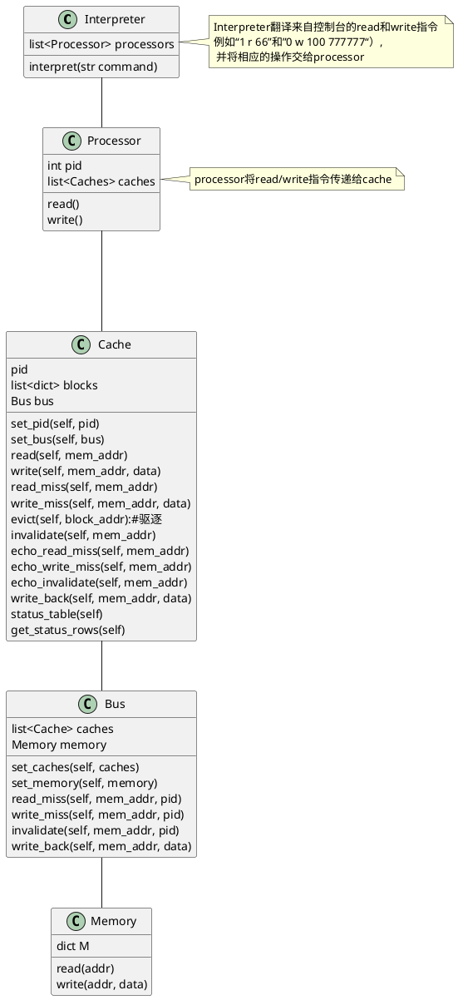
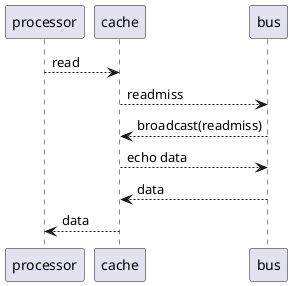
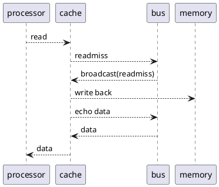
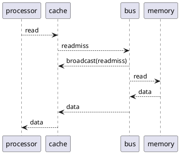

# MSI-protocol-simulator design
- [MSI-protocol-simulator design](#msi-protocol-simulator-design)
  - [设计思路](#设计思路)
  - [类间关系图](#类间关系图)
  - [MSI协议工作时序图（举例，只列举了3种情况）](#msi协议工作时序图举例只列举了3种情况)
  - [所用到的数据结构](#所用到的数据结构)
    - [cache](#cache)
    - [memory](#memory)
  - [为了方便使用和查看而设计的interpret类和show\_status\_tables方法](#为了方便使用和查看而设计的interpret类和show_status_tables方法)
    - [interpreter](#interpreter)
    - [show\_status\_tables](#show_status_tables)
  - [代码运行过程(下面的绿色字符为输入的命令,代码框里的是程序的输出)](#代码运行过程下面的绿色字符为输入的命令代码框里的是程序的输出)

## 设计思路
面向对象。
从命令的源头processor开始设计，processor只管对cache发出read和write命令。

由cache为processor提供服务。
cache应提供read和write方法，这两个方法需要一些别的方法来辅助完成。

cache读写miss时，只管把消息放到bus上，然后接受bus给的回应。

bus为cache提供服务，将caches和memory都连接到总线上，当总线接收到消息时，就对所有的cache广播（这里的广播是通过遍历查询实现的）。

memory 为只需为总线提供读写服务。

## 类间关系图


## MSI协议工作时序图（举例，只列举了3种情况）
我I，存在其他块为S


我I，且某一块为M

全I


## 所用到的数据结构
### cache
cache的blocks用python内置的list和dict实现，一个dict是list的一个元素。
每一个block如下
```python
block = {"status": "I","mem_addr": None,"data": None}
```
多个block构成一个list
```python
self.blocks = list()
for i in range(0, self.block_num):
    self.blocks.append(dict(self.block))
```
### memory
因为memory存储容量有多大在MSI协议设计中不重要，所以假定memeory无限大
用dict来实现memory的存储单元，这样，在外界（这里的外界是指cache和processor）看来，内存有无限的容量。

## 为了方便使用和查看而设计的interpret类和show_status_tables方法
### interpreter
解释命令
命令的格式为：processor_id operation mem_addr [data]</br>
processor_id指定哪一个处理器。
其中opereration只包括读（read/r/R）和写（write/w/W）。
mem_addr 为内存地址。
data 为要写入的数据， 如果opereration是write的话。
例如：
```
0 read 99
1 write 80 8888
2 r 77
3 w 66 666
2 R 66
2 W 77
```

### show_status_tables
打印每个cache的MSI状态表。
为了使输出稍微美观一点，使用了两个外部的python包
```python
from prettytable import PrettyTable
import pandas
```

## 代码运行过程(下面的绿色字符为输入的命令,代码框里的是程序的输出)
```
+---------------------------------------+
|                 cache0                |
+------------+--------+----------+------+
| block_addr | status | mem_addr | data |
+------------+--------+----------+------+
|     0      |   I    |   None   | None |
|     1      |   I    |   None   | None |
|     2      |   I    |   None   | None |
+------------+--------+----------+------+
+---------------------------------------+
|                 cache1                |
+------------+--------+----------+------+
| block_addr | status | mem_addr | data |
+------------+--------+----------+------+
|     0      |   I    |   None   | None |
|     1      |   I    |   None   | None |
|     2      |   I    |   None   | None |
+------------+--------+----------+------+
+---------------------------------------+
|                 cache2                |
+------------+--------+----------+------+
| block_addr | status | mem_addr | data |
+------------+--------+----------+------+
|     0      |   I    |   None   | None |
|     1      |   I    |   None   | None |
|     2      |   I    |   None   | None |
+------------+--------+----------+------+
command format: <processor_id> <space> <operation(read/write/r/R/w/W)> <space> <mem_addr> [<space> <data>]
enter 'quit' or 'exit' to end
such as, '0 read 99','1 write 99 80', '1 r 77'
```
<font color=#008000>0 r 99</font>
```
read miss for address 99
echo_read_miss for address 99
echo_read_miss for address 99
+---------------------------------------+
|                 cache0                |
+------------+--------+----------+------+
| block_addr | status | mem_addr | data |
+------------+--------+----------+------+
|     0      |   S    |    99    |  0   |
|     1      |   I    |   None   | None |
|     2      |   I    |   None   | None |
+------------+--------+----------+------+
+---------------------------------------+
|                 cache1                |
+------------+--------+----------+------+
| block_addr | status | mem_addr | data |
+------------+--------+----------+------+
|     0      |   I    |   None   | None |
|     1      |   I    |   None   | None |
|     2      |   I    |   None   | None |
+------------+--------+----------+------+
+---------------------------------------+
|                 cache2                |
+------------+--------+----------+------+
| block_addr | status | mem_addr | data |
+------------+--------+----------+------+
|     0      |   I    |   None   | None |
|     1      |   I    |   None   | None |
|     2      |   I    |   None   | None |
+------------+--------+----------+------+
```
<font color=#008000>0 w 99 9900</font>
```
write hit for address 99
invalidate for address 99
echo_invalidate for address 99
echo_invalidate for address 99
+---------------------------------------+
|                 cache0                |
+------------+--------+----------+------+
| block_addr | status | mem_addr | data |
+------------+--------+----------+------+
|     0      |   M    |    99    | 9900 |
|     1      |   I    |   None   | None |
|     2      |   I    |   None   | None |
+------------+--------+----------+------+
+---------------------------------------+
|                 cache1                |
+------------+--------+----------+------+
| block_addr | status | mem_addr | data |
+------------+--------+----------+------+
|     0      |   I    |   None   | None |
|     1      |   I    |   None   | None |
|     2      |   I    |   None   | None |
+------------+--------+----------+------+
+---------------------------------------+
|                 cache2                |
+------------+--------+----------+------+
| block_addr | status | mem_addr | data |
+------------+--------+----------+------+
|     0      |   I    |   None   | None |
|     1      |   I    |   None   | None |
|     2      |   I    |   None   | None |
+------------+--------+----------+------+
```
<font color=#008000>1 r 99</font>
```
read miss for address 99
echo_read_miss for address 99
write_back for address 99
+---------------------------------------+
|                 cache0                |
+------------+--------+----------+------+
| block_addr | status | mem_addr | data |
+------------+--------+----------+------+
|     0      |   S    |    99    | 9900 |
|     1      |   I    |   None   | None |
|     2      |   I    |   None   | None |
+------------+--------+----------+------+
+---------------------------------------+
|                 cache1                |
+------------+--------+----------+------+
| block_addr | status | mem_addr | data |
+------------+--------+----------+------+
|     0      |   S    |    99    | 9900 |
|     1      |   I    |   None   | None |
|     2      |   I    |   None   | None |
+------------+--------+----------+------+
+---------------------------------------+
|                 cache2                |
+------------+--------+----------+------+
| block_addr | status | mem_addr | data |
+------------+--------+----------+------+
|     0      |   I    |   None   | None |
|     1      |   I    |   None   | None |
|     2      |   I    |   None   | None |
+------------+--------+----------+------+
```
<font color=#008000>0 w 100 100000</font>
```
write miss for address 100
echo_write_miss for address 100
echo_write_miss for address 100
echo_write_miss for address 100
+-----------------------------------------+
|                  cache0                 |
+------------+--------+----------+--------+
| block_addr | status | mem_addr |  data  |
+------------+--------+----------+--------+
|     0      |   S    |    99    |  9900  |
|     1      |   M    |   100    | 100000 |
|     2      |   I    |   None   |  None  |
+------------+--------+----------+--------+
+---------------------------------------+
|                 cache1                |
+------------+--------+----------+------+
| block_addr | status | mem_addr | data |
+------------+--------+----------+------+
|     0      |   S    |    99    | 9900 |
|     1      |   I    |   None   | None |
|     2      |   I    |   None   | None |
+------------+--------+----------+------+
+---------------------------------------+
|                 cache2                |
+------------+--------+----------+------+
| block_addr | status | mem_addr | data |
+------------+--------+----------+------+
|     0      |   I    |   None   | None |
|     1      |   I    |   None   | None |
|     2      |   I    |   None   | None |
+------------+--------+----------+------+
```
<font color=#008000>0 w 77 10</font>
```
write miss for address 77
echo_write_miss for address 77
echo_write_miss for address 77
echo_write_miss for address 77
+-----------------------------------------+
|                  cache0                 |
+------------+--------+----------+--------+
| block_addr | status | mem_addr |  data  |
+------------+--------+----------+--------+
|     0      |   S    |    99    |  9900  |
|     1      |   M    |   100    | 100000 |
|     2      |   M    |    77    |   10   |
+------------+--------+----------+--------+
+---------------------------------------+
|                 cache1                |
+------------+--------+----------+------+
| block_addr | status | mem_addr | data |
+------------+--------+----------+------+
|     0      |   S    |    99    | 9900 |
|     1      |   I    |   None   | None |
|     2      |   I    |   None   | None |
+------------+--------+----------+------+
+---------------------------------------+
|                 cache2                |
+------------+--------+----------+------+
| block_addr | status | mem_addr | data |
+------------+--------+----------+------+
|     0      |   I    |   None   | None |
|     1      |   I    |   None   | None |
|     2      |   I    |   None   | None |
+------------+--------+----------+------+
```
<font color=#008000>0 w 66 6666666</font>
```
write miss for address 66
echo_write_miss for address 66
echo_write_miss for address 66
echo_write_miss for address 66
evict for address 99, with block_addr 0
+------------------------------------------+
|                  cache0                  |
+------------+--------+----------+---------+
| block_addr | status | mem_addr |   data  |
+------------+--------+----------+---------+
|     0      |   M    |    66    | 6666666 |
|     1      |   M    |   100    |  100000 |
|     2      |   M    |    77    |    10   |
+------------+--------+----------+---------+
+---------------------------------------+
|                 cache1                |
+------------+--------+----------+------+
| block_addr | status | mem_addr | data |
+------------+--------+----------+------+
|     0      |   S    |    99    | 9900 |
|     1      |   I    |   None   | None |
|     2      |   I    |   None   | None |
+------------+--------+----------+------+
+---------------------------------------+
|                 cache2                |
+------------+--------+----------+------+
| block_addr | status | mem_addr | data |
+------------+--------+----------+------+
|     0      |   I    |   None   | None |
|     1      |   I    |   None   | None |
|     2      |   I    |   None   | None |
+------------+--------+----------+------+
```
<font color=#008000>2 w 77 777777</font>
```
write miss for address 77
echo_write_miss for address 77
write_back for address 77
echo_write_miss for address 77
echo_write_miss for address 77
+------------------------------------------+
|                  cache0                  |
+------------+--------+----------+---------+
| block_addr | status | mem_addr |   data  |
+------------+--------+----------+---------+
|     0      |   M    |    66    | 6666666 |
|     1      |   M    |   100    |  100000 |
|     2      |   I    |    77    |    10   |
+------------+--------+----------+---------+
+---------------------------------------+
|                 cache1                |
+------------+--------+----------+------+
| block_addr | status | mem_addr | data |
+------------+--------+----------+------+
|     0      |   S    |    99    | 9900 |
|     1      |   I    |   None   | None |
|     2      |   I    |   None   | None |
+------------+--------+----------+------+
+-----------------------------------------+
|                  cache2                 |
+------------+--------+----------+--------+
| block_addr | status | mem_addr |  data  |
+------------+--------+----------+--------+
|     0      |   M    |    77    | 777777 |
|     1      |   I    |   None   |  None  |
|     2      |   I    |   None   |  None  |
+------------+--------+----------+--------+

```
